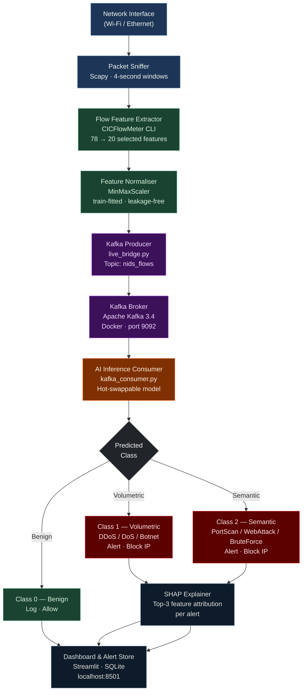

# Live Bridge — Real-Time Inference Pipeline

**Figure X.** Live Bridge real-time inference pipeline. Network packets are captured in 4-second windows, converted to 20 bidirectional flow features by CICFlowMeter, normalised by a train-fitted MinMaxScaler, and published to a Kafka topic. The AI Consumer classifies each flow into one of three classes; detected attacks trigger SHAP-attributed alerts and automated IP blocking.
