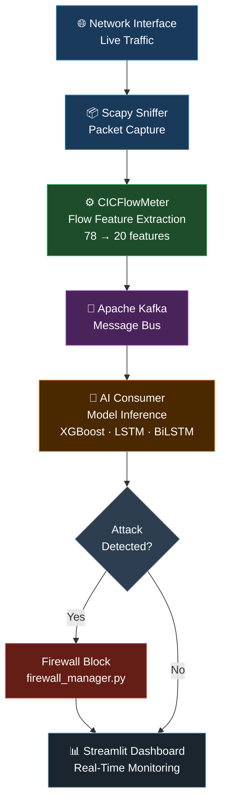

# AI-Driven NIDS — System Architecture

```mermaid
flowchart TD
    A["🌐 Network Interface\nLive Traffic"]
    B["📦 Scapy Sniffer\nPacket Capture"]
    C["⚙️ CICFlowMeter\nFlow Feature Extraction\n78 → 20 features"]
    D["📨 Apache Kafka\nMessage Bus"]
    E["🤖 AI Consumer\nModel Inference\nXGBoost · LSTM · BiLSTM"]
    F{"Attack\nDetected?"}
    G[" Firewall Block\nfirewall_manager.py"]
    H["📊 Streamlit Dashboard\nReal-Time Monitoring"]

    A --> B --> C --> D --> E --> F
    F -- Yes --> G --> H
    F -- No  --> H

    style A fill:#1a3a5c,stroke:#2e86c1,color:#fff
    style B fill:#1a3a5c,stroke:#2e86c1,color:#fff
    style C fill:#1e4d2b,stroke:#27ae60,color:#fff
    style D fill:#4a235a,stroke:#8e44ad,color:#fff
    style E fill:#4a2800,stroke:#e67e22,color:#fff
    style F fill:#2c3e50,stroke:#bdc3c7,color:#fff
    style G fill:#641e16,stroke:#c0392b,color:#fff
    style H fill:#1a252f,stroke:#85c1e9,color:#fff
```
